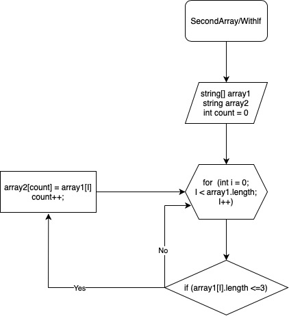

# finaltask
**Описание алгоритма решения:**

Объявляем два алгоритма решения: первоначальный и второй такой же длины. Далее метод, в котором цикл соразмерный длине массива, внутри цикла проверка условия (<=3), если "Да", элемент первого массива заносится в count элемент второго массива. Переменная count, чтобы поочередно закидывать из первого массива во второй, и чтобы потом не было пробелов. После присвоения увеличивается переменная count на 1 и возвращается к циклу for, в котором i увеличивается на 1. И так проверяется до конца.

[Решение алгоритма в папке Task_solution] (https://github.com/anastasia-zaporozhets/finaltask/blob/main/Task_solution/Program.cs)